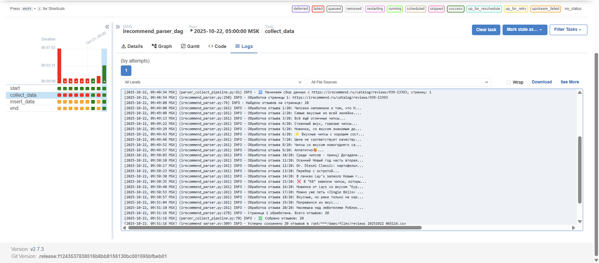
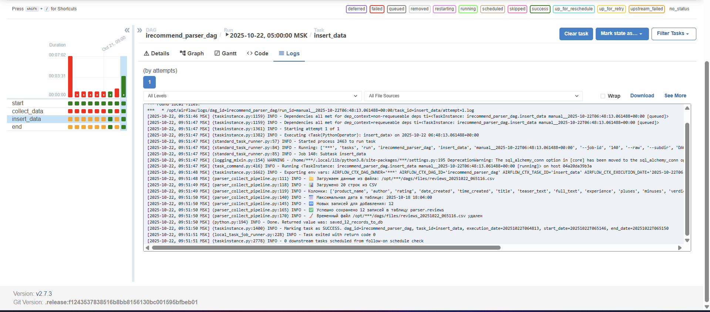
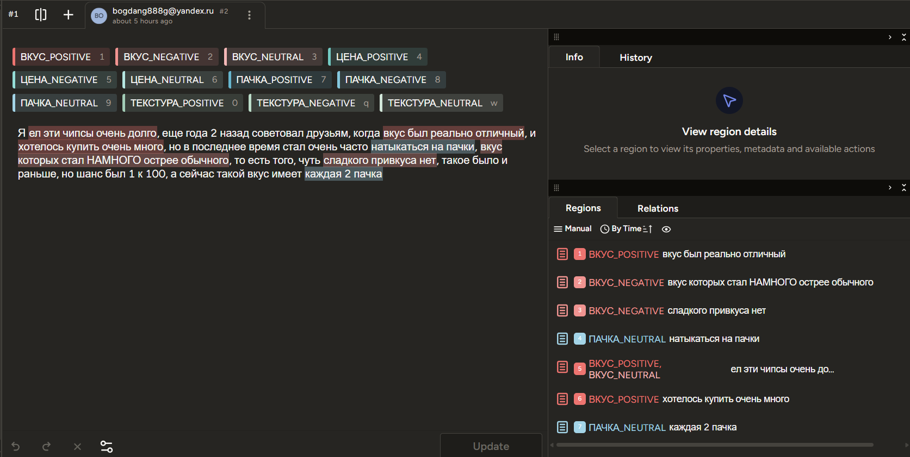
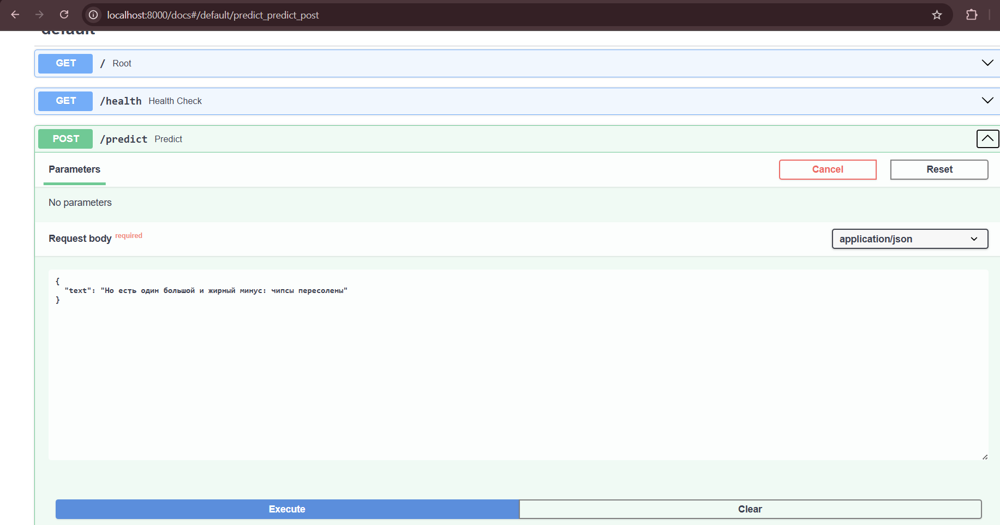
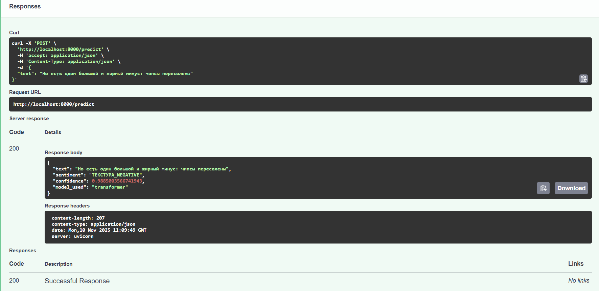
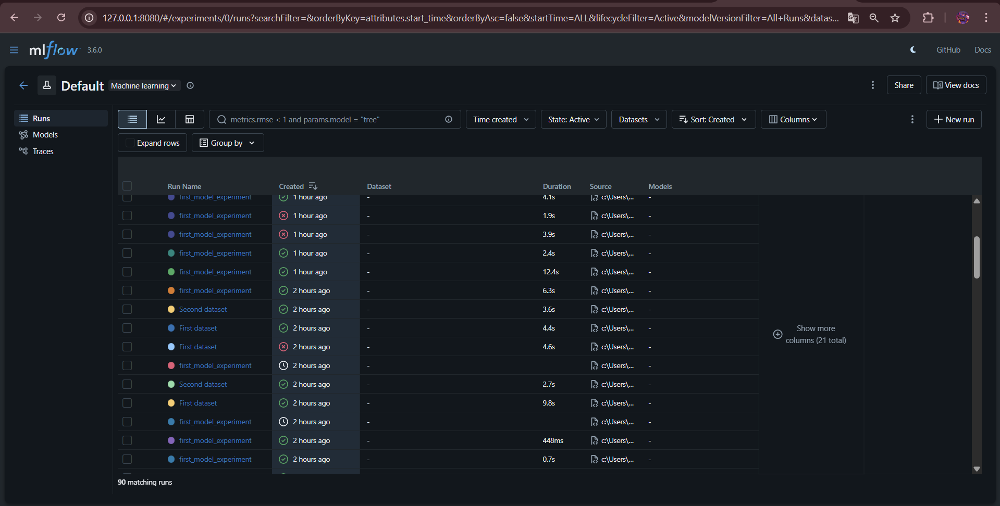
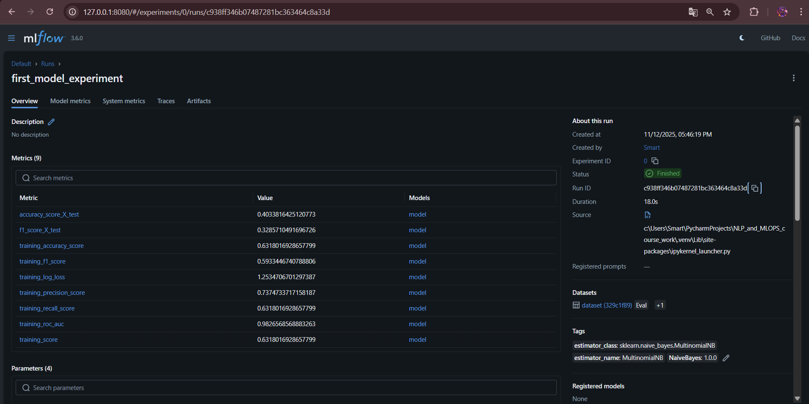
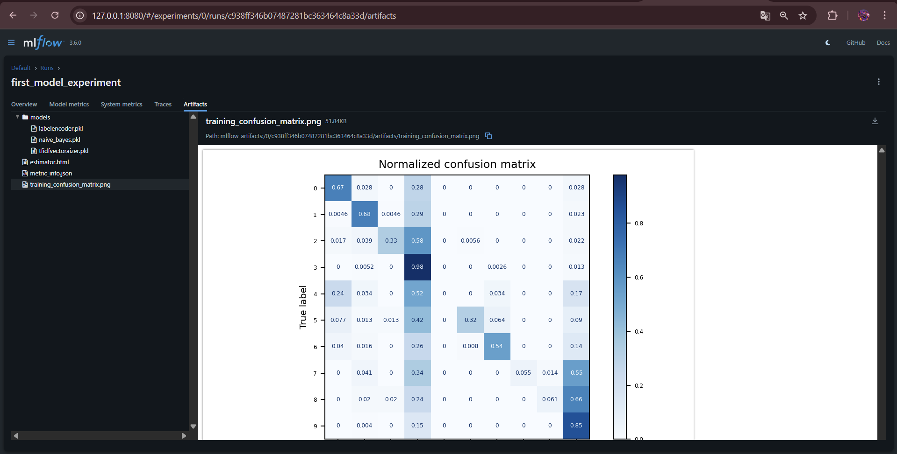

# Курсовая работа по NLP и MLOPS Aspect-Based Sentiment Analysis (ABSA) 

Собираю данные ежедневно и заношу актуальные в базу данных при помощи Airflow. Данные содержат отзывы по чипсам картофельным (ЧСК обычные) с сайта [Ireccomend](https://irecommend.ru/catalog/reviews/939-13393)

На основе отзывов определяю параметры вкуса и состояние чипсов, то есть характеристики: пачка, вкус, текстура

После чего размечаю данные вручную, обучаю модель NLP для распознания атрибутов товара 

Далее вывожу все собранные данные и полученные параметры по вкусам через FastApi и Streamlit для наглядности и интерпретации

Данный инструмент поможет моей компании (Кафталь) составлять и вводить новые вкусы, учитывая потребности и желания рынка


## Сбор данных:

> TODO: реализовать парсер для сайта "Отзовик"

Был написан парсер сайта Ireccomend, чтобы извлекать инфорацию из каждого отзыва:

| Поле | Описание |
|------|----------|
| **id** | Уникальный идентификатор отзыва |
| **product_name** | Название продукта |
| **author** | Автор отзыва |
| **rating** | Рейтинг продукта |
| **date_created** | Дата создания отзыва |
| **time_created** | Время создания отзыва |
| **combined_created** | Объединенная дата и время |
| **title** | Заголовок отзыва |
| **teaser_text** | Краткое описание (тизер) |
| **full_text** | Полный текст отзыва |
| **experience** | Опыт использования |
| **pluses** | Преимущества продукта |
| **minuses** | Недостатки продукта |
| **verdict** | Вывод автора |
| **review_url** | URL отзыва |
| **scraped_at** | Время парсинга |
| **created_at** | Время создания записи |


Автоматизация запуска парсера (раз в сутки, в 5 утра) была реализована через Airflow:

Данные для входа:

* Логин: `admin`

* Пароль: `admin`





## Разметка текста:

Разметка текста по лейблам производится в LabelStudio


```cmd
label-studio start
```

Перейти в labelStudio и создать проект:
http://localhost:8080/

Данные для аутентификации:

* Login: `admin`
* Password: `admin123`




## Запуск инференса-сервиса (FAST API):

```cmd
docker build -t sentiment-api .

docker run -p 8000:8000 sentiment-api
```

http://localhost:8000/





## Проведение экспериментов в MLFlow



